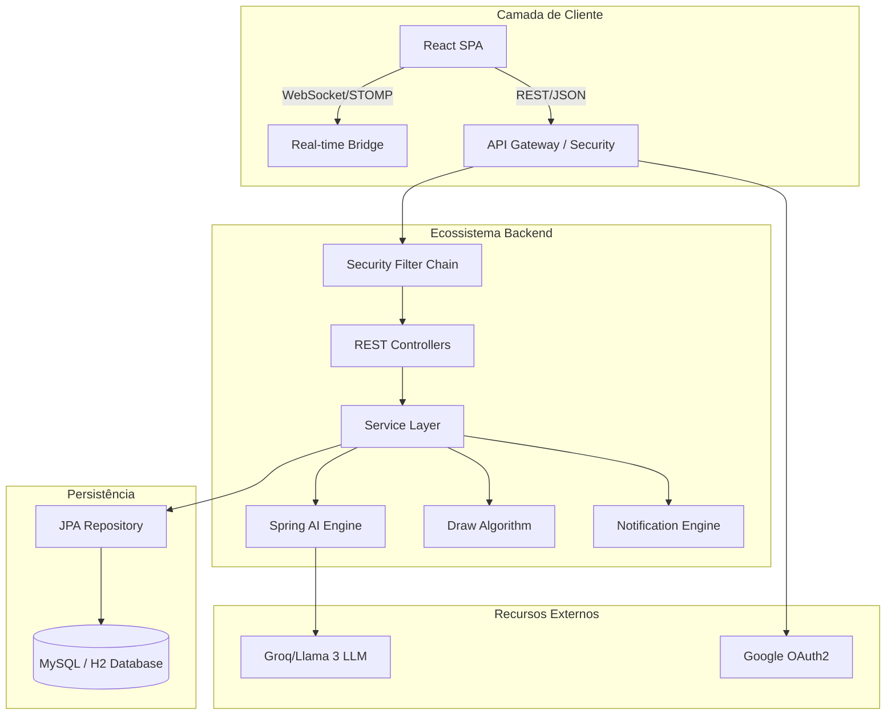
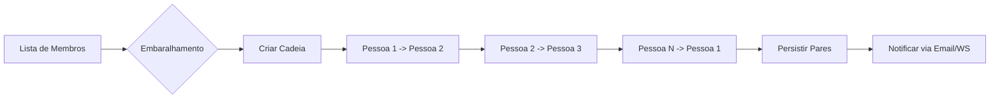
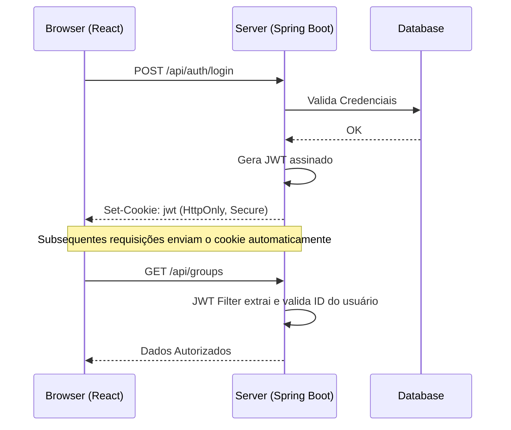

# 🎁 Secret Wish: The Intelligent Secret Santa Platform

<div align="center">
  <p align="center">
    
  </p>
  <p align="center">
    <strong>Elevando a tradição do Amigo Secreto ao próximo nível com IA generativa, sincronização em tempo real e arquitetura de segurança de ponta.</strong>
  </p>

  <!-- Status & Badges -->
  <p align="center">
    
    
    
    
    
  </p>
</div>

---

## 📖 Sobre o Projeto

O **Secret Wish** é uma solução Fullstack completa para organização de Amigo Secreto. Diferente de ferramentas simples, ele foca na **experiência do usuário** e na **resolução de atritos**:
- **O dilema do presente:** Resolvido por IA que analisa a wishlist e sugere itens compatíveis.
- **A quebra de segredo:** Evitada por chats anônimos onde o sorteador pode tirar dúvidas sem se revelar.
- **A falha do sorteio:** Impedida por um algoritmo de cadeia circular que garante que ninguém fique de fora ou tire a si mesmo.

---

## 🛠️ Stack Tecnológica de Elite

### 💻 Backend (Robustez & Segurança)
*   **Java 21 (LTS):** Utilizando as últimas features de performance e linguagem.
*   **Spring Boot 3.5:** Ecossistema principal para serviços REST e WebSockets.
*   **Spring Security + OAuth2:** Fluxo de autenticação híbrido (Local + Google).
*   **JWT + Cookies HttpOnly:** Sessões seguras protegidas contra ataques XSS e CSRF.
*   **Spring Data JPA + Hibernate:** Camada de persistência resiliente com suporte a múltiplos dialetos.
*   **Spring AI:** Integração agnóstica com provedores de IA (configurado com Groq Cloud).
*   **Flyway:** Controle de versão rigoroso do esquema de banco de dados.

### 🎨 Frontend (Experiência do Usuário)
*   **React 19:** O estado da arte em bibliotecas de interface.
*   **Vite 6:** Build tool ultra-rápida.
*   **Framer Motion:** Animações baseadas em física para uma UI "viva".
*   **Lucide React:** Iconografia moderna e consistente.
*   **StompJS & SockJS:** Comunicação real-time via WebSockets para chats e notificações.
*   **Vanilla CSS + Glassmorphism:** Design proprietário focado em profundidade e transparência.

---

## 📐 Engenharia de Software & Arquitetura

O sistema foi desenhado seguindo princípios de **Clean Architecture** e **S.O.L.I.D**, garantindo baixo acoplamento e alta testabilidade.

### 🏗️ Arquitetura de Macro-Nível


### 🎲 Algoritmo de Sorteio Circular (Circular Chain Draw)
Diferente de sorteios aleatórios simples, nossa lógica garante um ciclo hamiltoniano fechado.



### 🔐 Fluxo de Segurança & JWT
Implementamos o padrão de "Stateless Auth with Stateful Control" usando cookies.



---

## 🌟 Funcionalidades Principais (Deep Dive)

### 🤖 Inteligência Artificial Sugestiva
O sistema não apenas lista desejos, ele os interpreta. Se você adicionou "Cafeteira" e "Moedor", a IA (Llama 3 via Groq) pode sugerir ao seu amigo secreto marcas específicas de grãos gourmet ou filtros especiais, baseando-se no perfil de itens.

### 💬 Chat Híbrido: Revelado vs Anônimo
O backend gerencia o "contexto de visão" de cada mensagem:
1.  **Doador para Recebedor:** O doador vê o nome real do recebedor.
2.  **Recebedor para Doador:** O recebedor vê o remetente como "Seu Amigo Secreto".
3.  **Filtro de Integridade:** O backend bloqueia mensagens caso o par não exista no sorteio atual.

---

## 📁 Estrutura do Projeto

```text
.
├── backend/               # Nucleo de Inteligencia & API
│   ├── src/main/java      # Domínio, Serviços, Segurança e Controllers
│   ├── src/main/resources # Configurações, SQL Migrations e Templates de Email
│   └── data/              # Storage local para desenvolvimento
├── frontend/              # Interface & Interação
│   ├── src/api            # Centralização de Axios e Interceptores
│   ├── src/services       # Camada de integração (REST & WebSockets)
│   ├── src/pages          # Componentes de tela e lógica de UI
│   └── src/components     # Elementos reutilizáveis de Design System
└── docs/                  # Documentação técnica e especificações
```

---

## 🚀 Guia de Início Rápido

### Pré-requisitos
- **Java 21**
- **Node.js 18+**
- **Maven** (Opcional, mvnw incluso)

### Execução Unificada (Local)

1.  **Backend:**
    ```bash
    cd backend
    ./mvnw spring-boot:run
    ```
    *O banco H2 será criado automaticamente em `./backend/data/`.*

2.  **Frontend:**
    ```bash
    cd frontend
    npm install
    npm run dev
    ```

3.  **Acesse:** `http://localhost:5173`

---

## 🛡️ Segurança de Produção

O projeto conta com o `ProductionSafetyValidator`, que impede que a aplicação suba em perfil de produção (`prod`) caso:
- O Segredo JWT seja o padrão ou muito curto.
- A flag `app.dev-auth.enabled` esteja ativa.
- O Banco de dados esteja configurado sem senha.
- As origens de CORS contenham wildcards (`*`).

---

## 👤 Integrantes do GRUPO

**David** - *Idealização e Desenvolvimento Frontend*
- [GitHub](https://github.com/d4vid-dev)

**Beatriz** - * Designer e Desenvolvimento Frontend*
- [GitHub](https://github.com/BeatrizYashodara)

**Martha** - *Desenvolvimento Backend e Documentação*
- [GitHub](https://github.com/Martha-coda)

**Kayk** - *Idealização e Desenvolvimento Backend*
- [GitHub](https://github.com/KaykAmaral)

---
<div align="center">
  <p>Construído com a robustez do ecossistema Java e a agilidade do React.</p>
  <p>© 2026 Secret Wish Project.</p>
</div>
