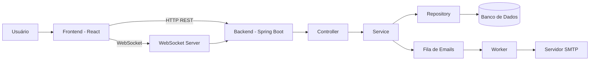
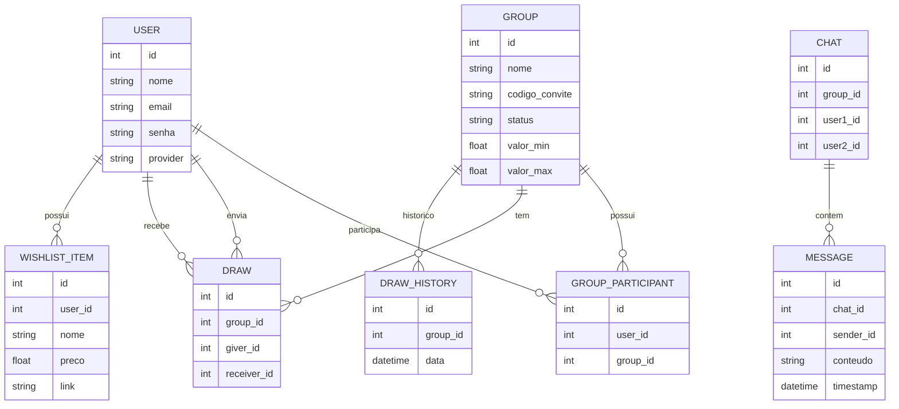
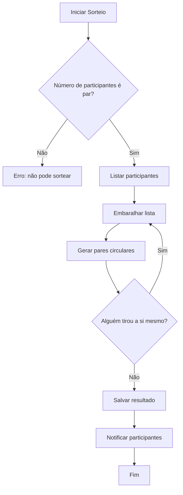
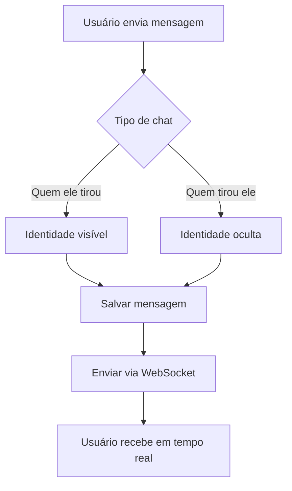

# 📌 SPECS.md — Amigo Secreto Inteligente

## 📖 Visão Geral

Sistema web para gerenciamento de amigo secreto com:

* sorteio automático
* lista de desejos
* chat anônimo em tempo real
* notificações por email

Arquitetura baseada em frontend + backend separados.

---

# 🧱 Arquitetura

## 📌 Tecnologias

* Frontend: React
* Backend: Spring Boot
* Banco: MySQL
* Autenticação: JWT + Google OAuth
* Comunicação:

  * REST (operações gerais)
  * WebSocket (chat em tempo real)

## 🏗️ Diagrama de Arquitetura

Este diagrama representa a estrutura geral do sistema,
incluindo frontend, backend, banco de dados e serviços auxiliares.

---

# 🔐 Autenticação e Segurança

## 📌 Métodos de Login

* Email + senha
* Google OAuth

## 📌 Segurança

* Senhas criptografadas (bcrypt)
* Autenticação via JWT
* Controle de acesso por grupo
* Dados sensíveis nunca expostos na API

## ⚠️ Regra importante

* Identidade no chat é ocultada apenas na interface
* Backend controla o que pode ou não ser exibido

---

# 🗄️ Modelagem de Dados

## 📊 Diagrama Entidade-Relacionamento

Este diagrama apresenta as entidades principais do sistema
e seus relacionamentos.

## 👤 User

* id
* nome
* email (único)
* senha
* provider (LOCAL / GOOGLE)

## 👥 Group

* id
* nome
* codigo_convite
* lider_id
* status (ABERTO, SORTEADO, FINALIZADO)
* valor_min (opcional)
* valor_max (opcional)

## 🤝 GroupParticipant

* id
* user_id
* group_id

## 🎲 Draw

* id
* group_id
* giver_id
* receiver_id

## 🔁 DrawHistory

* id
* group_id
* data

## 🎁 WishlistItem

* id
* user_id
* nome
* preco
* link

## 💬 Chat

* id
* group_id
* user1_id
* user2_id

## 💬 Message

* id
* chat_id
* sender_id
* conteudo
* timestamp

---

# 🎲 Lógica do Sorteio

## 🔄 Fluxo do Sorteio

Este diagrama mostra o processo de execução do sorteio,
garantindo que as regras de negócio sejam respeitadas.

## 📌 Regras

* Ninguém pode tirar a si mesmo
* Cada participante tem:

  * 1 pessoa que presenteia
  * 1 pessoa que o presenteia
* Resultado é sigiloso

## 📌 Algoritmo

1. Listar participantes
2. Embaralhar lista
3. Associar:

   * i → i+1
   * último → primeiro

## 🔁 Re-sorteio

* Apenas o líder pode executar
* Requer confirmação
* Histórico deve ser salvo

---

# 💬 Chat em Tempo Real

## 🔄 Fluxo do Chat

Este diagrama representa o envio e recebimento de mensagens
em tempo real, respeitando as regras de anonimato.

## 📌 Tecnologia

* WebSocket (Spring + STOMP)

## 📌 Estrutura

Cada usuário possui:

* chat com quem ele tirou
* chat com quem tirou ele

## 📌 Regras

* Identidade pode ser ocultada dependendo do contexto
* Mensagens persistidas no banco
* Histórico acessível

---

# 📧 Sistema de Email

## 📌 Funcionalidades

* Enviar resultado do sorteio
* Notificar novas mensagens
* Notificar eventos (entrada em grupo)

## 📌 Implementação

* SMTP (Gmail ou similar)
* Envio assíncrono

---

# 🎨 Frontend

## 📌 Telas

* Login / Cadastro
* Dashboard
* Grupos
* Lista de desejos
* Chat
* Perfil

## 📌 Fluxo principal

1. Usuário autentica
2. Cria ou entra em grupo
3. Aguarda sorteio
4. Recebe resultado
5. Interage via lista e chat

---

# 📡 API (visão geral)

## 🔐 Auth

* POST /auth/register
* POST /auth/login
* POST /auth/google

## 👤 User

* GET /users/me
* PUT /users/me
* DELETE /users/me

## 👥 Groups

* POST /groups
* GET /groups
* POST /groups/join
* POST /groups/{id}/draw
* POST /groups/{id}/redraw

## 🎁 Wishlist

* GET /wishlist
* POST /wishlist
* PUT /wishlist/{id}
* DELETE /wishlist/{id}

## 💬 Chat

* GET /chats
* GET /chats/{id}/messages

## 💬 WebSocket

* /ws/chat
* /topic/messages
* /app/send

---

# 🚀 Deploy

## 📌 Sugestão

* Frontend: Vercel
* Backend: Render / Railway
* Banco: MySQL cloud

---

# 📊 Considerações Técnicas

## ⚠️ Pontos Críticos

* Autenticação (JWT + OAuth)
* Sincronização do chat em tempo real
* Controle de acesso por grupo
* Segurança das APIs

## ✅ Estratégia de Entrega

1. Autenticação
2. Grupos + sorteio
3. Lista de desejos
4. Email
5. Chat em tempo real

---

# 🧩 Boas Práticas

* Commits pequenos e frequentes
* Branch por feature
* Integração contínua entre frontend e backend
* Testes a cada funcionalidade entregue
* Evitar adicionar novas features durante o desenvolvimento
