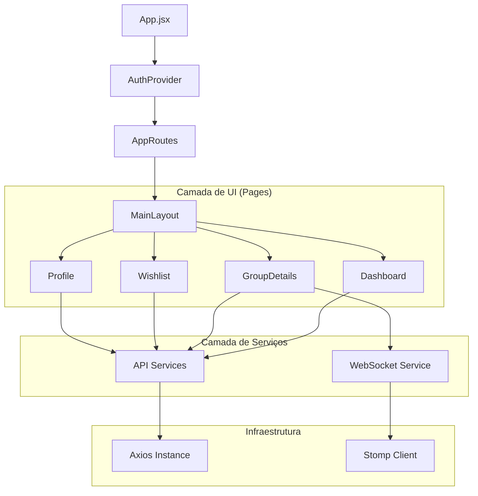
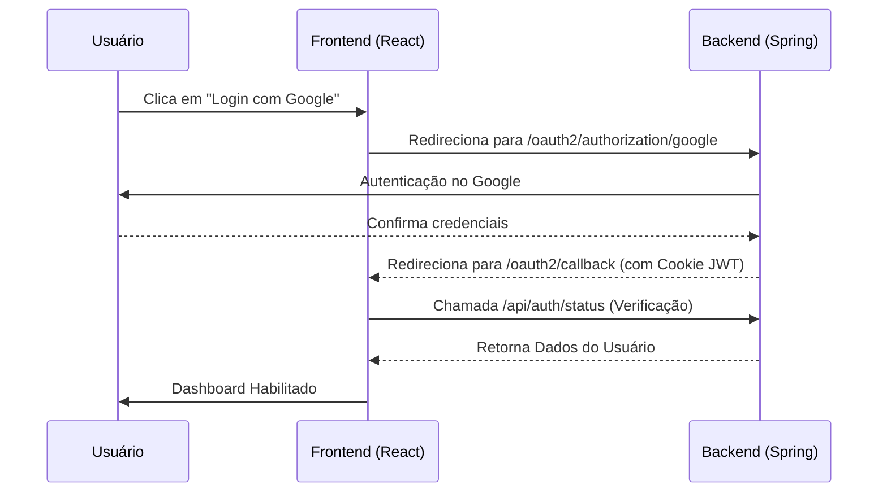
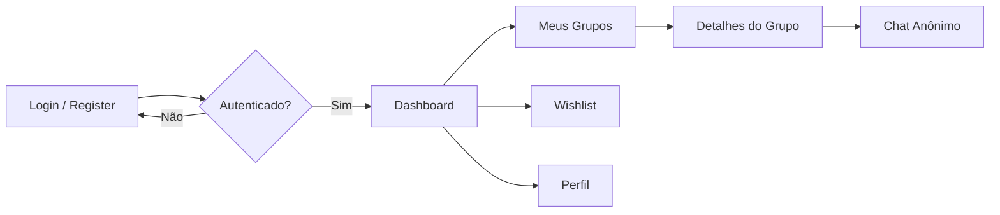

# 🎁 Secret Wish - Frontend

<div align="center">
  
  <p align="center">
    <strong>A plataforma inteligente de Amigo Secreto potenciada por IA e interações em tempo real.</strong>
  </p>

  [](https://reactjs.org/)
  [](https://vitejs.dev/)
  [](https://www.framer.com/motion/)
  [](LICENSE)
</div>

---

## 🌟 Visão Geral

O **Secret Wish Frontend** é uma Single Page Application (SPA) moderna projetada para transformar a experiência tradicional de Amigo Secreto. Com um design elegante baseado em **Glassmorphism**, a aplicação oferece uma interface fluida e intuitiva para gerenciar grupos, realizar sorteios algorítmicos e facilitar a comunicação anônima entre participantes.

Utilizando as últimas tecnologias do ecossistema React, o sistema garante segurança na autenticação, atualizações instantâneas via WebSockets e uma experiência de usuário (UX) enriquecida com animações suaves e sugestões inteligentes.

---

## 🚀 Funcionalidades Principais

| Funcionalidade | Descrição |
| :--- | :--- |
| **🔐 Autenticação Dual** | Login tradicional via e-mail/senha ou integração rápida com Google OAuth2. |
| **👥 Gestão de Grupos** | Criação e entrada em grupos via códigos únicos (`XXXX-XXXX`). |
| **🎲 Sorteio Inteligente** | Interface para acionamento do algoritmo de sorteio circular (sem repetições). |
| **📜 Wishlist Dinâmica** | Gerenciamento de itens desejados com links externos para lojas. |
| **💬 Chat Anônimo** | Sistema de mensageria privada entre o "amigo" e quem o tirou, sem revelar identidades. |
| **⚡ Real-time Updates** | Notificações e mensagens entregues instantaneamente via WebSockets (STOMP). |
| **🎨 UI Premium** | Estética moderna com efeitos de vidro, modo escuro nativo e responsividade total. |

---

## 🛠️ Tecnologias Utilizadas

### Core
- **React 19:** Biblioteca base para construção da interface declarativa.
- **Vite:** Build tool ultra-rápida para desenvolvimento frontend.
- **React Router 7:** Gerenciamento de navegação e proteção de rotas.

### Estado & Comunicação
- **Context API:** Gerenciamento de estado global de autenticação.
- **Axios:** Cliente HTTP para integração com a API REST.
- **StompJS & SockJS:** Protocolos para comunicação bidirecional via WebSockets.

### UI & UX
- **Framer Motion:** Biblioteca de animações para transições de página e componentes.
- **Lucide React:** Conjunto de ícones vetoriais consistentes.
- **Vanilla CSS (Glassmorphism):** Estilização customizada com foco em profundidade e transparência.
- **Emoji Picker React:** Integração de seletor de emojis no chat.

---

## 📐 Arquitetura do Frontend

A aplicação segue uma arquitetura modular e baseada em responsabilidades claras, facilitando a manutenção e escalabilidade.



---

## 🔄 Fluxos da Aplicação

### 🔑 Fluxo de Autenticação
O sistema utiliza um fluxo híbrido para garantir que a sessão seja validada tanto no cliente quanto no servidor através de cookies seguros.



### 📡 Navegação & Proteção de Rotas
As rotas são hierarquizadas para garantir que o layout comum seja reaproveitado e que dados sensíveis não sejam exibidos a usuários não autenticados.



---

## 📂 Estrutura de Pastas

```text
frontend/src/
├── api/            # Configuração base do Axios e interceptores
├── assets/         # Imagens, logotipos e recursos estáticos
├── components/     # Componentes reutilizáveis (Modais, Gavetas, Botões)
├── context/        # Provedores de estado global (AuthContext)
├── hooks/          # Custom hooks (useAuth, etc.)
├── layouts/        # Estruturas de página compartilhadas (MainLayout)
├── pages/          # Componentes de tela principais (Dashboard, Profile)
├── routes/         # Configuração de rotas e Guardiões (ProtectedRoute)
├── services/       # Abstração de chamadas para API e WebSockets
├── App.jsx         # Componente raiz
└── main.jsx        # Ponto de entrada do React
```

---

## 💻 Configuração do Ambiente

### Pré-requisitos
- **Node.js:** v18 ou superior
- **NPM** ou **Yarn**
- **Backend Operacional:** Certifique-se de que o backend do Secret Wish está rodando em `http://localhost:8080`.

### Instalação

1. Clone o repositório:
```bash
git clone https://github.com/David/Secret_Wish.git
```

2. Acesse a pasta do frontend:
```bash
cd Secret_Wish/frontend
```

3. Instale as dependências:
```bash
npm install
```

---

## 🛠️ Scripts Disponíveis

| Script | Comando | Descrição |
| :--- | :--- | :--- |
| **Dev** | `npm run dev` | Inicia o servidor de desenvolvimento do Vite. |
| **Build** | `npm run build` | Compila o projeto para produção na pasta `dist/`. |
| **Lint** | `npm run lint` | Executa o ESLint para verificar padrões de código. |
| **Preview** | `npm run preview` | Inicia um servidor local para testar o build de produção. |

---

## 🎨 UI/UX e Design System

A interface do Secret Wish foi concebida sob os pilares de **profundidade** e **legibilidade**:

- **Glassmorphism:** Uso de fundos translúcidos com `backdrop-filter: blur`, criando uma hierarquia visual moderna.
- **Feedback Visual:** Estados de loading customizados, esqueletos (*skeletons*) para carregamento de chat e animações de entrada via Framer Motion.
- **Acessibilidade:** Cores contrastantes, rótulos ARIA para elementos interativos e navegação via teclado facilitada.
- **Responsividade:** Layout adaptável para Mobile, Tablet e Desktop através de CSS Grid e Flexbox.

---
<div align="center">
  <p>© 2026 Secret Wish. Todos os direitos reservados.</p>
</div>
